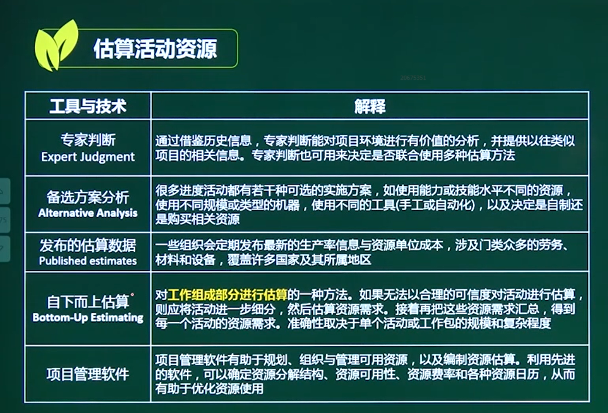

# 估算活动资源

## 一、概念

### 1 、定义

项目实施活动时 要使用何种**资源（人员、设备、物资）**以及数量，以及**何时用于项目计划活动**

### 2、作用

明确资源用哪些，估算**成本和持续时间**

注意：要同成本估算紧密配合

### 3、项目日历

编排开展计划活动的  **工作日和轮流班次**

考虑假期等因素

### 4、资源日历

表明 **每种具体资源的可用工作日**

## 二、估算活动资源

### 主要考工作技术

 

### 自下而上估算

较为细致。能准确一点。

