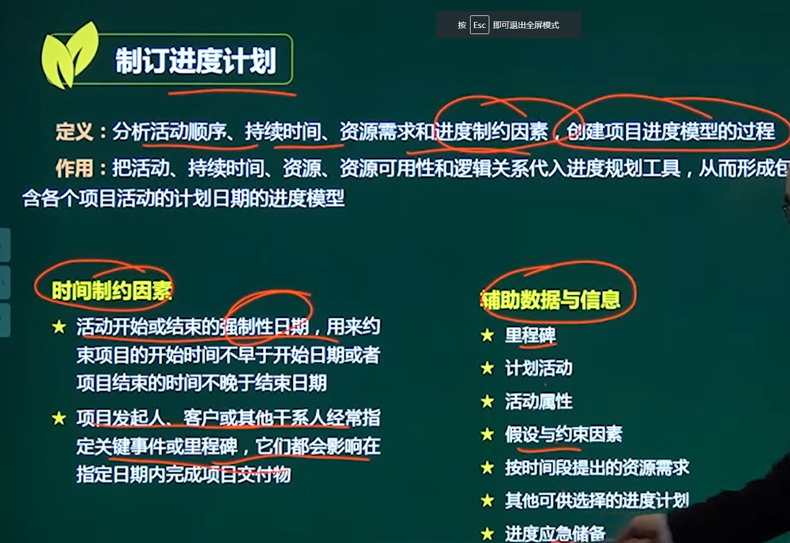
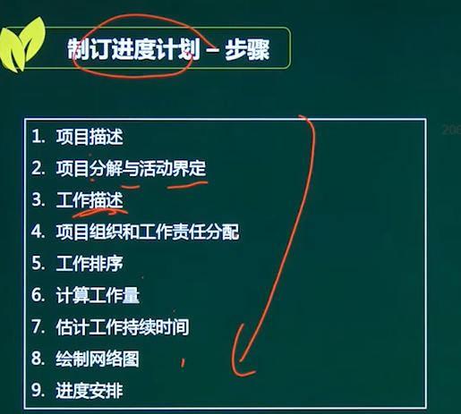
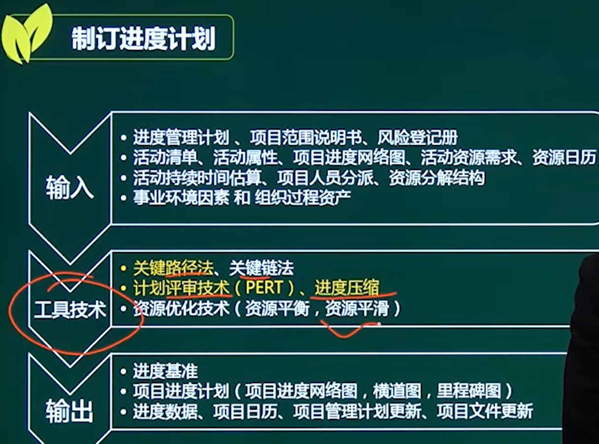
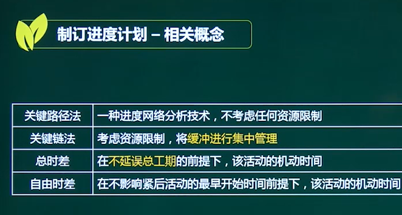

# 制定进度计划（重点）

## 一、相关概念

### 1、定义

分析**活动顺序、持续时间、资源需求、进度制约**等因素，创建项目的**进度模型**

### 2、作用

把活动、持续时间、资源、资源可用性代入进度规划工具，形成进度模型

### 3、时间制约因素

1、活动开始或结束的强制性日期（客户要求等）

2、指定里程碑等限制时间

## 二、步骤

## 三、输入输出

