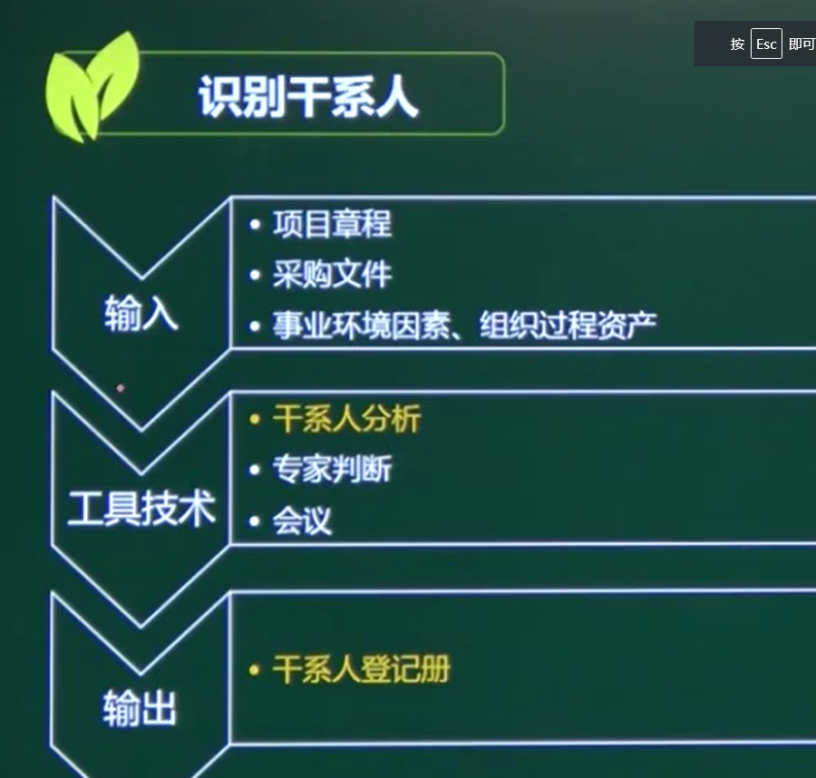
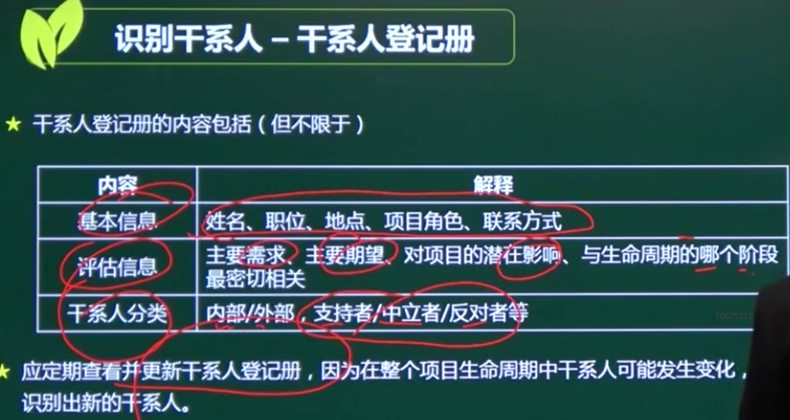

# 识别干系人

## 一、干系人分析

### 1、权力/利益方格（重点）

#### 影响项目--------------主动参与

#### 改变项目执行能力----------执行能力

#### 1、令其满意：政府官员

#### 2、重点管理：客户、项目经理主管领导

#### 3、随时告知：供应商

#### 4、监督        ：

### 2、权力/影响方格

### 3、影响/作用方格

### 4、凸显模型

权力、紧急程度、合法性

## 二、干系人登记册

