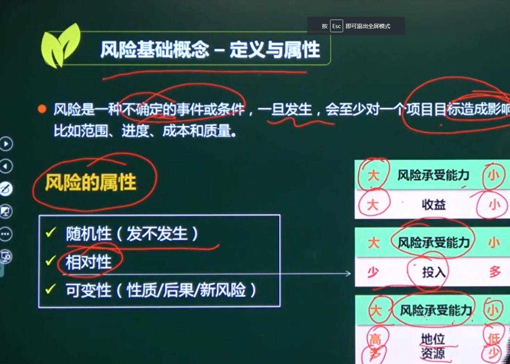
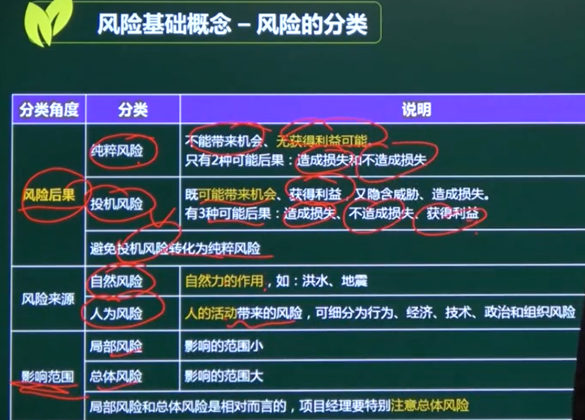
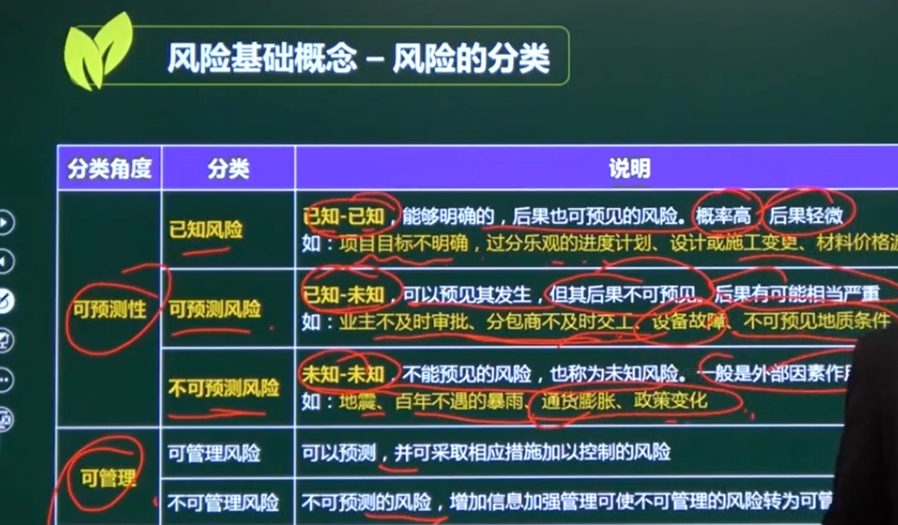

# 风险的概念

## 一、风险

**分为正面和负面**

**不确定的事件或条件**，一旦发生，会至少对**一个项目目标**产生影响

比如范围、进度、成本和质量

## 二、风险的属性

### 1、随机性

### 2、相对性

对于不同的企业、人  风险有可能是正面，有可能是负面

#### 风险承受力

1、高风险承受力   高回报

2、投入越多，风险承受力越小

3、地位资源高、多  风险的承受力越高

### 3、可变性（性质/后果/新风险）

## 三、风险的分类

### 1、后果

#### 纯粹风险

无获利可能性，只会有两种后果、造成损失和不造成损失

#### 机会风险

可能带来机会（获利）、造成损失和不造成损失和获得利益

避免把机会风险转换为纯粹风险

### 2、来源

天灾人祸

#### 自然风险

#### 人为风险

### 3、影响范围

#### 局部风险

#### 总体风险

局部风险  总体风险是相对而言的

### 4、可预测性

#### 已知风险   已知-已知

能够明确的，后果也可以预见的

概率高 后果轻微

如：项目目标不明确、过度乐观的进度计划、设计或施工变更、材料价格波动

#### 可预测风险 已知-未知

可以预见发生、单不能预测后果

后果不明确

不及时审批、不及时交工、设备故障、地质条件

#### 不可预测风险 未知-未知

罕见的暴雨、通货膨胀、政策

### 5、可管理

#### 可管理风险

可预测

#### 不可管理风险

不可预测

