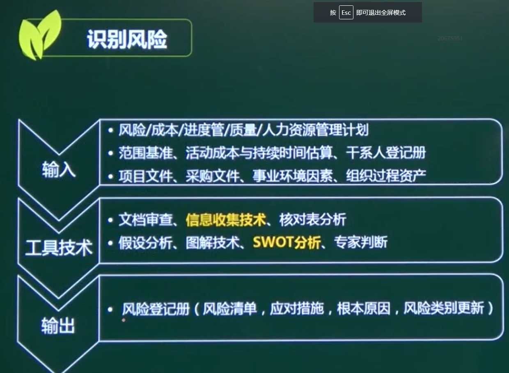
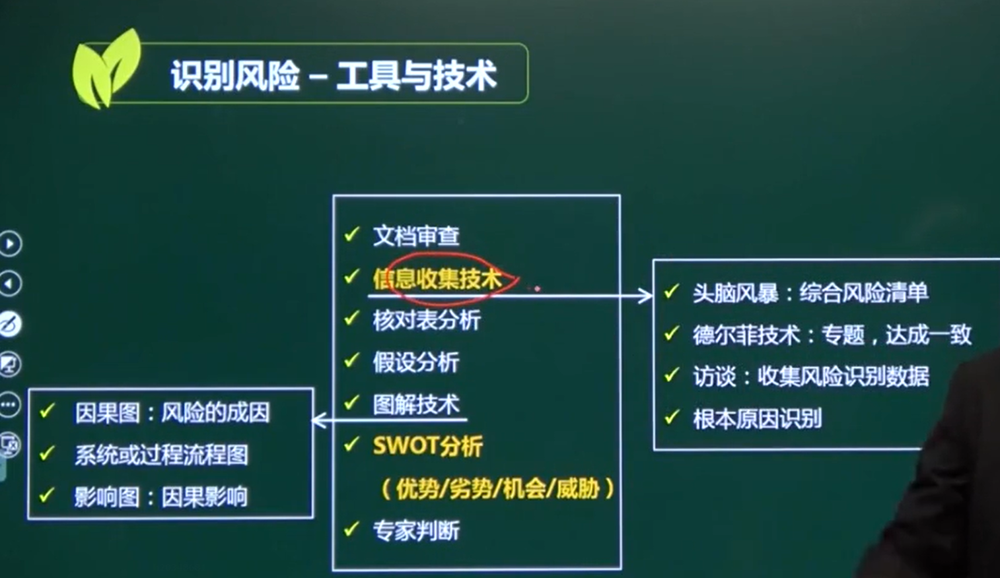
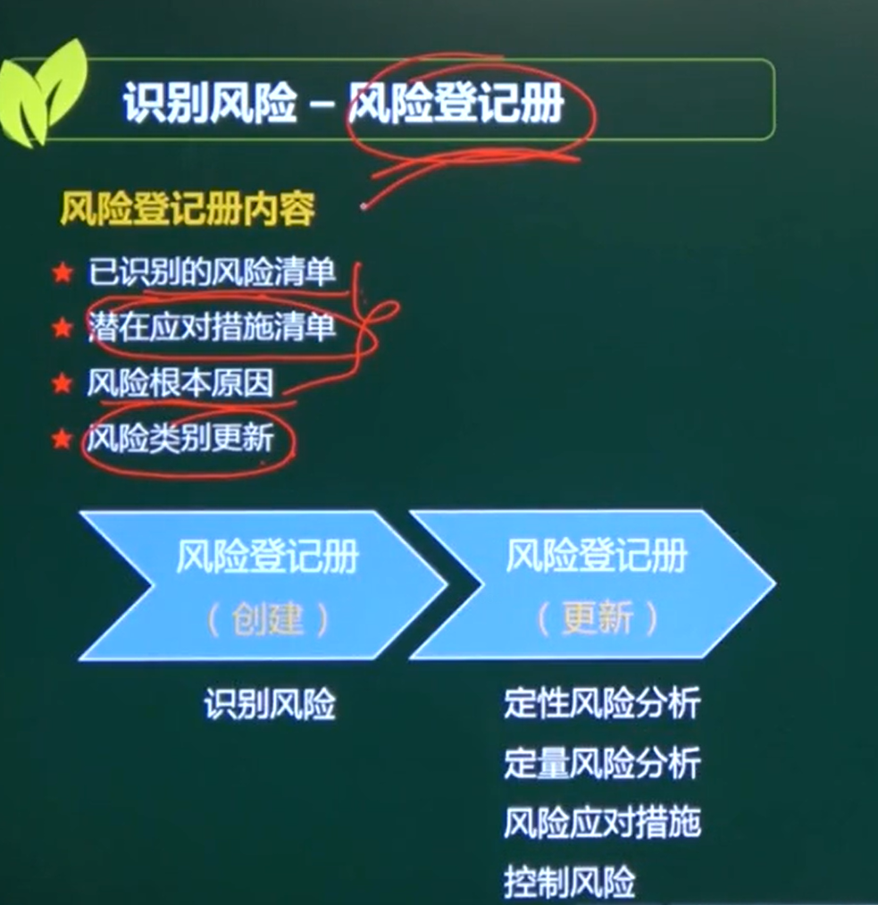

# 识别风险

## 一、定义

确定哪些风险会影响项目、讲其特性记载成文、**要求全员参与**

1、识别有哪些风险

2、引起风险的因素

3、风险的后果

## 二、识别风险的原则 重点

**全员性**

**系统性  RBS**

**动态性**

风险的识别 不是只识别一次

**信息依赖性**

**综合性**

## 三、输入输出

### 1、信息收集技术

#### 头脑风暴

#### 德尔菲技术（专家判断法）

#### 访谈

#### 根本原因识别

### 2、SWOT分析  态势分析法

S （strengths）是优势、W （weaknesses）是劣势、O （opportunities）是机会、T （threats）是威胁。

### 3、风险登记册-内容

#### 1、已识别风险的清单

#### 2、潜在应对措施清单

#### 3、风险的根本原因

#### 4、风险类别更新

