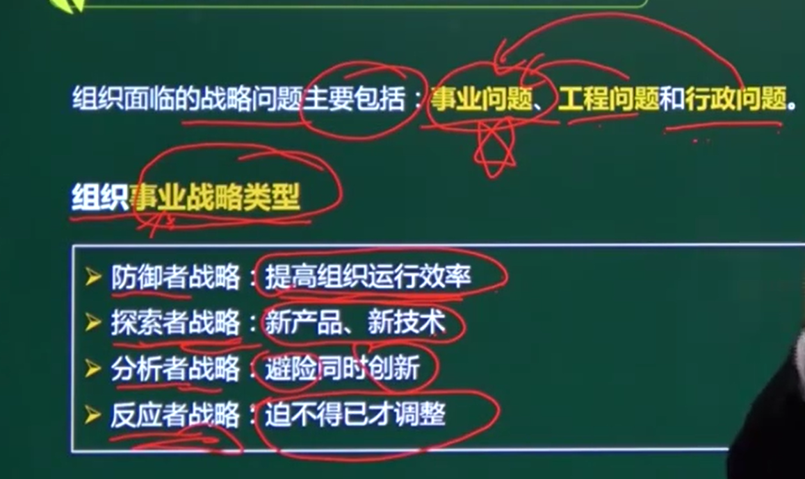
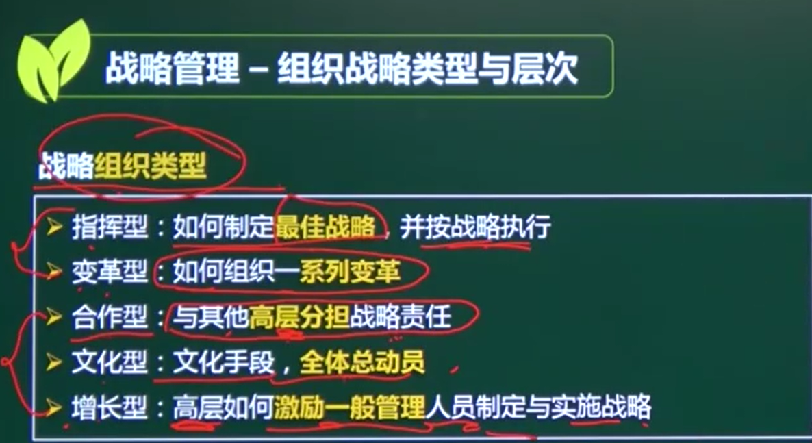
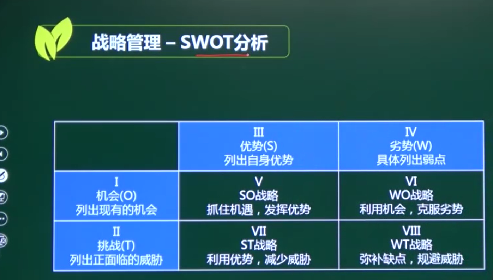

# 企业管理知识

## 一、战略管理（考1分）

### 1、组织战略的重点：

#### 未来发展方向

#### 资源配置策略

### 2、组织战略的主要内容

#### 战略目标

#### 战略方针         （指定纲领）

#### 战略实施能力

#### 战略措施

### 3、组织战略类型

#### 面临的战略问题：事业问题、工程问题、行政问题

防御者战略

探索者战略

分析者战略

反应者战略

### 4、战略组织类型

指挥型

变革型

合作型

文化型

增长型

#### 5、组织战略层次

目标层

方针层

行为层

### 6、SWOT分析

S （strengths）是优势、W （weaknesses）是劣势、O （opportunities）是机会、T （threats）是威胁。

### 

## 二、用户流程管理（考1分）

## 三、知识管理
