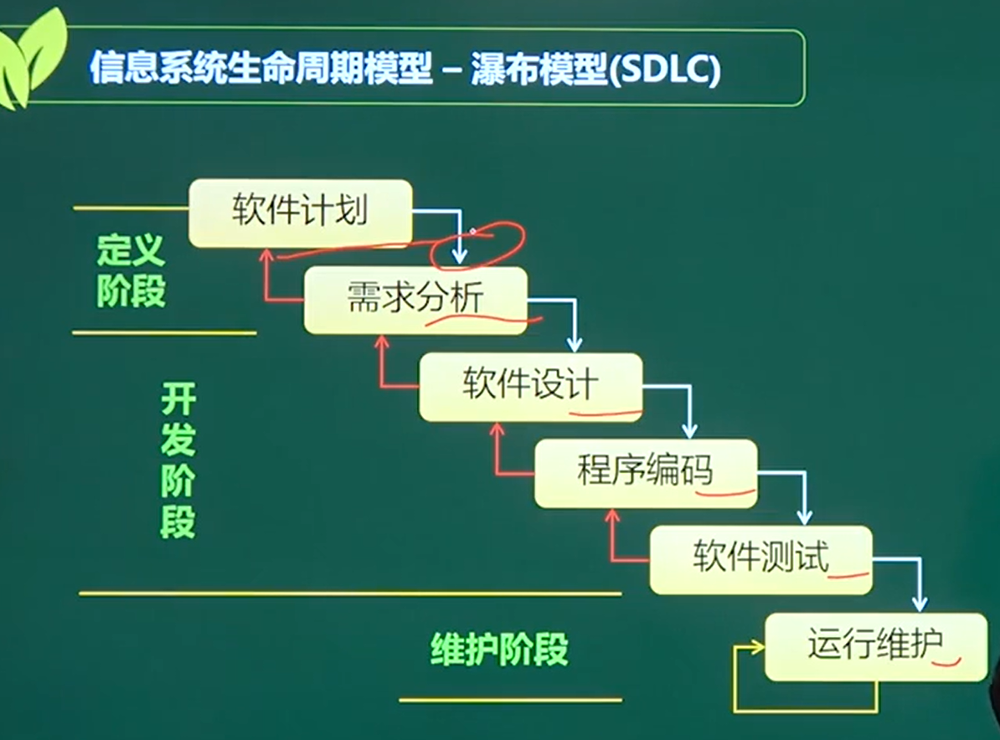
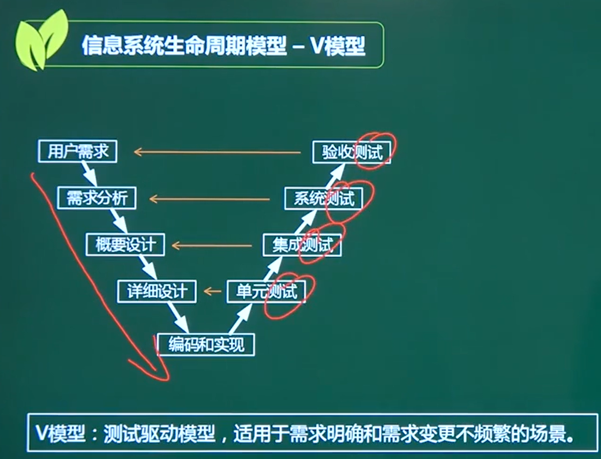
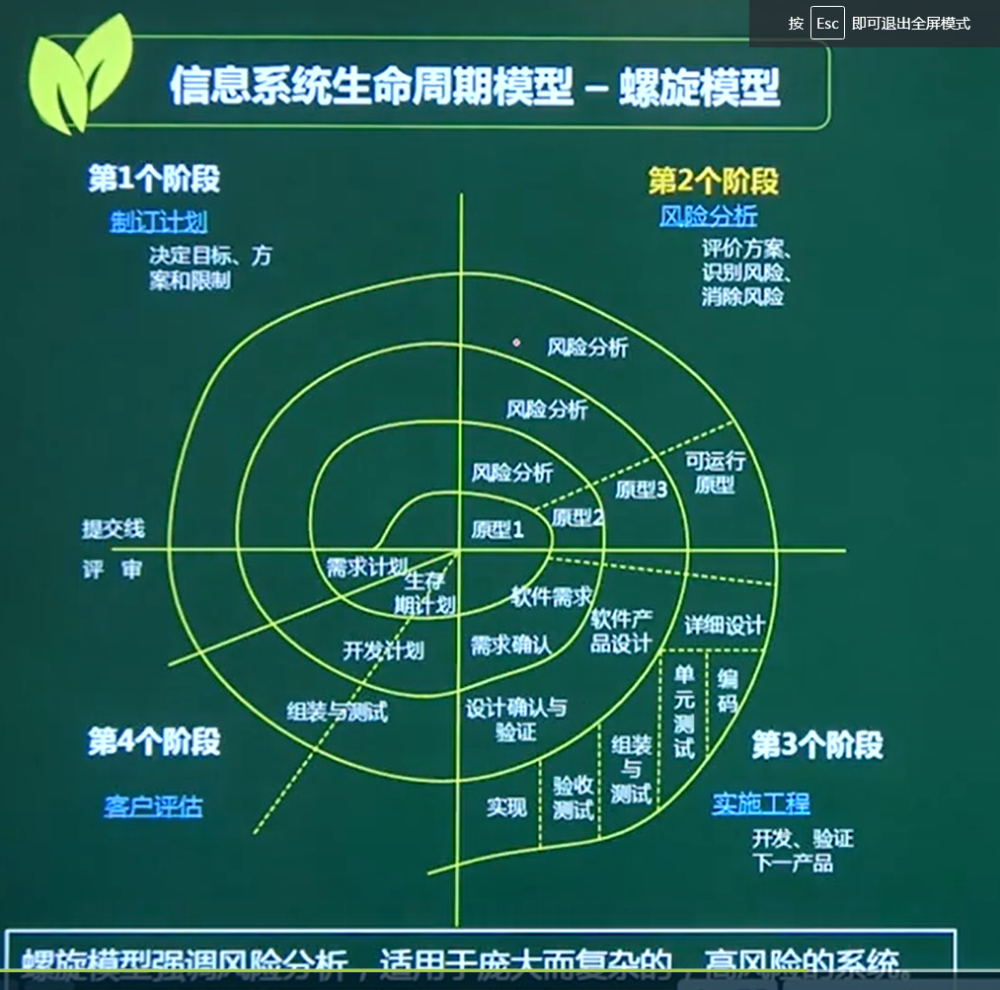
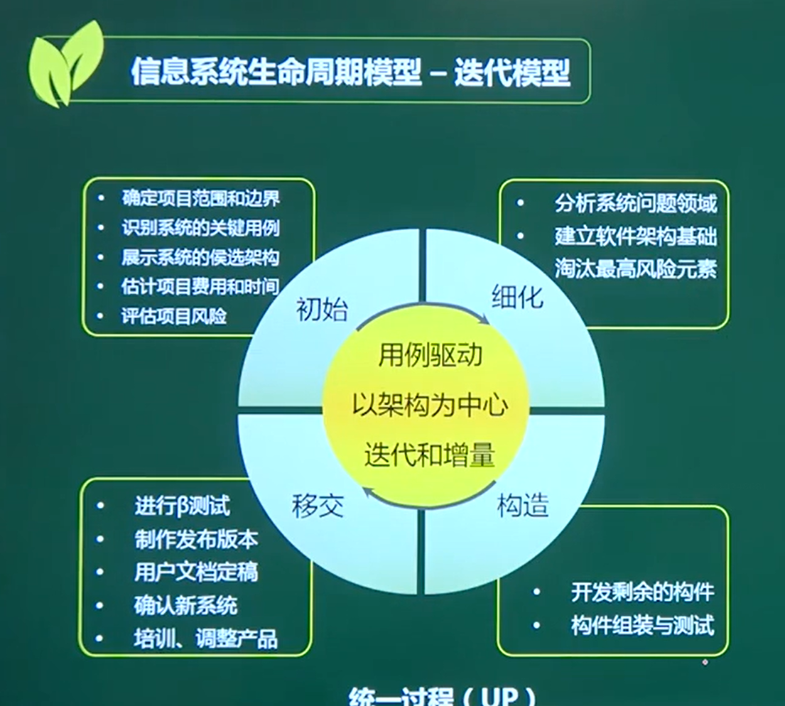
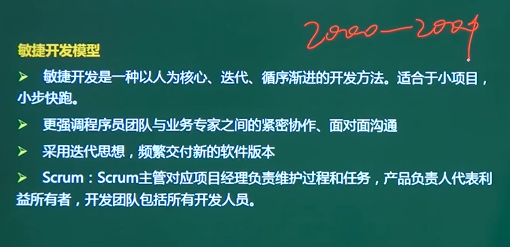

一两分

# 信息系统生命周期模型

问你在某个场景用哪个模型

## 一、瀑布模型

**结构化方法**的经典模型

### 瀑布模型的突出缺点是不适应用户需求的变化。

### 需求要明确才能用

## 二、V模型

### 瀑布模型的改进

### 测试驱动

### 需求明确、变更少、突出测试的场景

## 三、原型化模型

原型化模型是为弥补[瀑布模型](https://baike.baidu.com/item/瀑布模型/9817778)的不足而产生的。目的是为减少开发风险。

### 需求不明确

### 分为

### 抛弃型原型

（只为了获取需求）

### 进化型原型

（按原型做）

## 四、螺旋模型

### 主要是风险分析

它兼顾了[快速原型](https://baike.baidu.com/item/快速原型/7432267)的[迭代](https://baike.baidu.com/item/迭代/8415523)的特征以及[瀑布模型](https://baike.baidu.com/item/瀑布模型/9817778)的系统化与严格监控。螺旋模型最大的特点在于引入了其他模型不具备的风险分析，使软件在无法排除重大风险时有机会停止，以减小损失。同时，在每个迭代阶段构建原型是螺旋模型用以减小风险的途径。螺旋模型更适合大型的昂贵的系统级的软件应用。

## 五、迭代模型

### 统一过程 （UP）

## 六、敏捷开发

### 频繁交付新的软件版本

