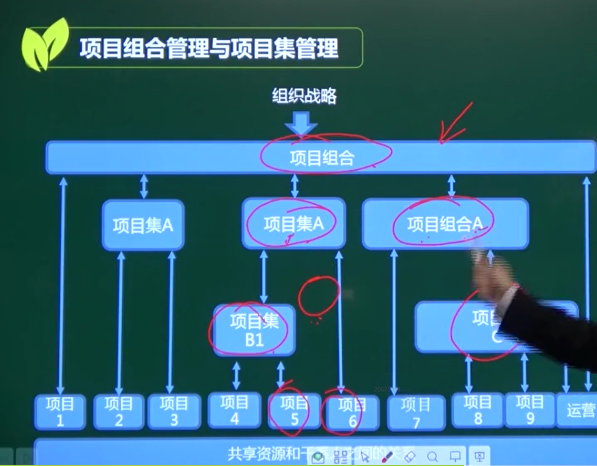
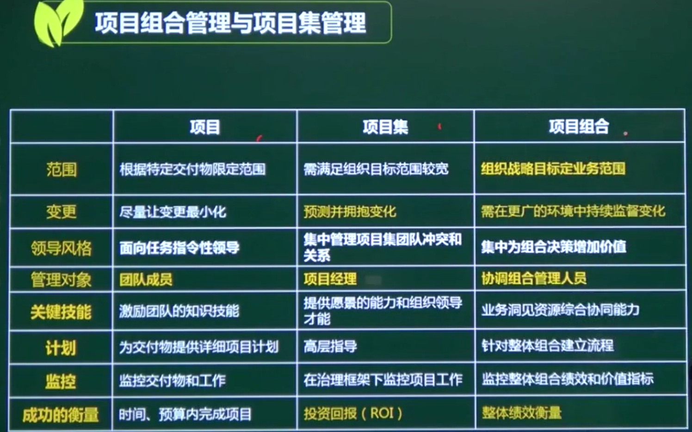
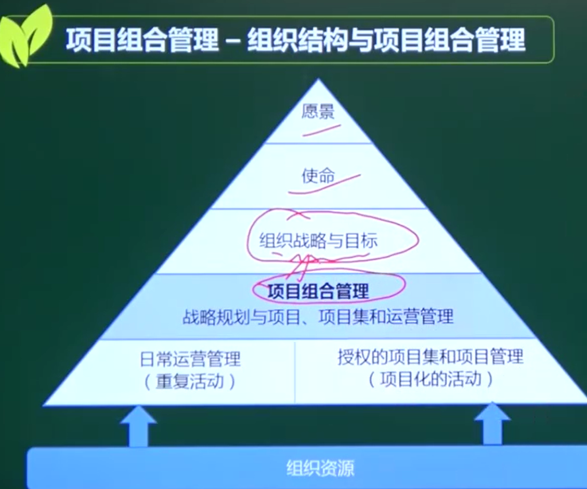

# 项目组合管理、项目集管理

## 一、概念

### 项目组合 要比 项目集大，项目组合可以包含项目集

### 项目组合

为实现**战略目标**而组合在一起管理对项目集、项目或运营工作

（**不要求是关联项目**）（仅需要共享客户、供应商、技术或资源）

### 项目集

**一组相关联的项目、子项目集**（内在相关性）

### 项目组合管理

一个或多个项目组合的协同管理

### 项目集管理

获得分别管理各项目所无法实现的收益和控制

内网OA和外网OA

