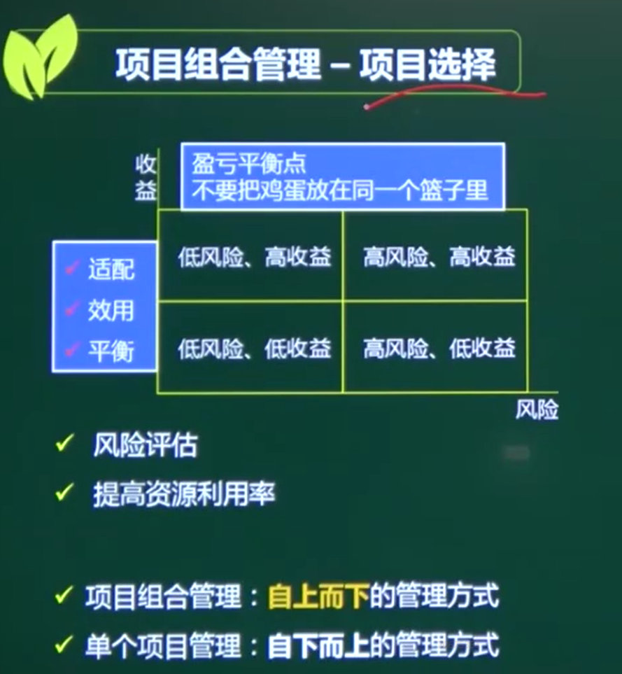
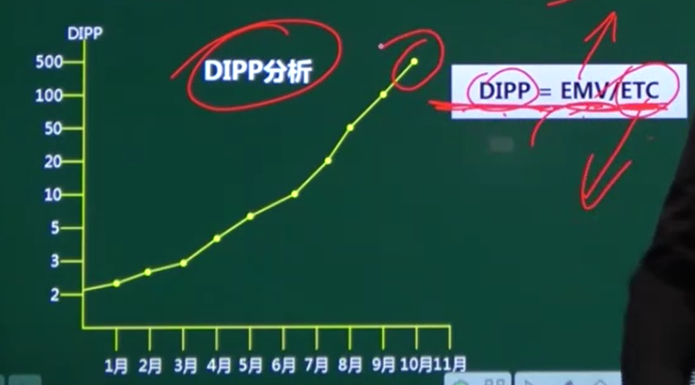
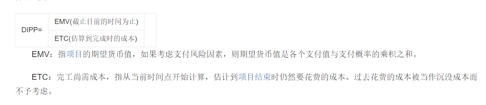
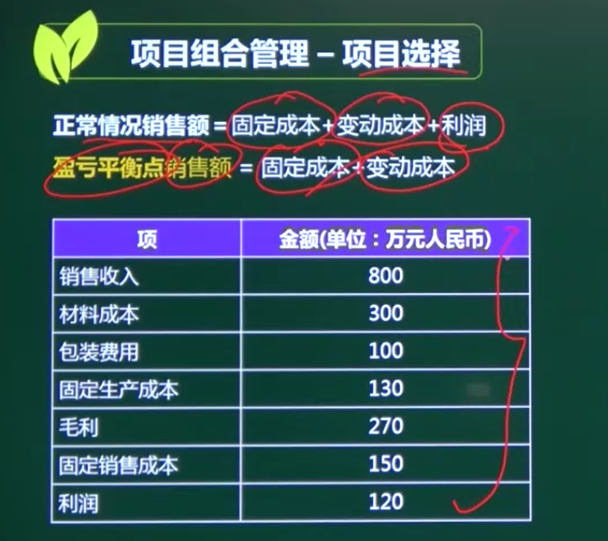
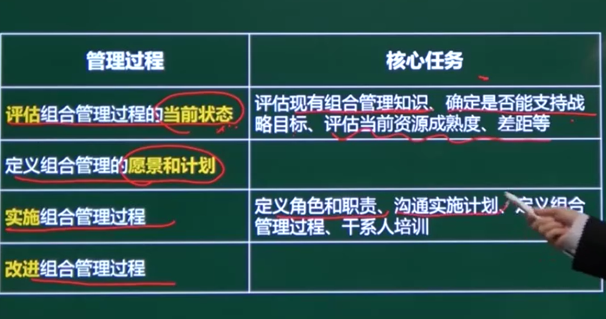

# 项目组合管理

## 一、项目选择

### 风险和收益

### 二、项目选择排序

#### 1、DIPP分析 德沃项目绩效指数

#### DIPP = EMV / ETV            期望货币价值/完工剩余成本

DIPP越高 越优先选择

#### DIPP低于1 不能选择  （类似于烂尾楼 再投资100w只能赚80w）

### 2、盈亏平衡（不赚不赔）

#### 正常情况销售额 = 固定成本 + 变动成本 + 利润

#### 盈亏平衡 销售额  = 固定成本 + 变动成本

固定成本 = 130 + 150 = 280

#### 分析 销售额和变动成本的关系

300+ 100 / 800

变动成本/销售额 50%

销售额 = 280 + 0.5 * 销售额

560W为盈亏平衡

### 3、决策表

### 4、财务分析

## 三、项目组合管理-过程实施

A  9  5

B  7  3

C  6  2

D  5 2

E  3  1

9

