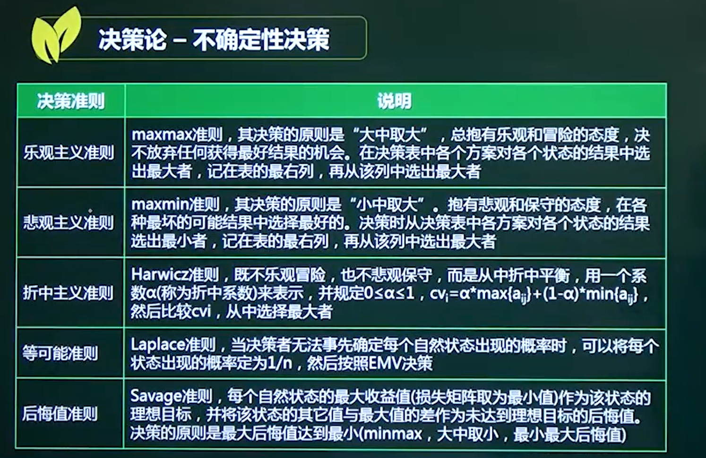
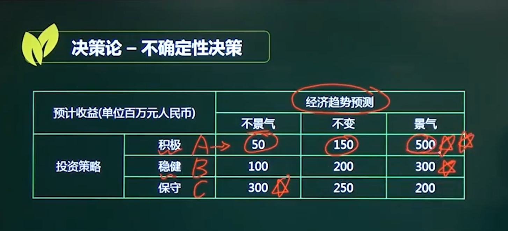

## 1、决策树、决策表

#### 数学期望：

陆路： 10000

水路： 7000 * 0.75 + 16000 * 0.25 = 5250 + 4000 = 9250

####  选水路

## 2、不确定性决策

### 1、乐观主义准则 maxmax 大中取大

#### 取 500 选择积极的解决方案！

### 2、悲观主义准则 maxmin 小中取大

### 3、等可能准则

### 4、后悔值准则  minmax 大中取小

