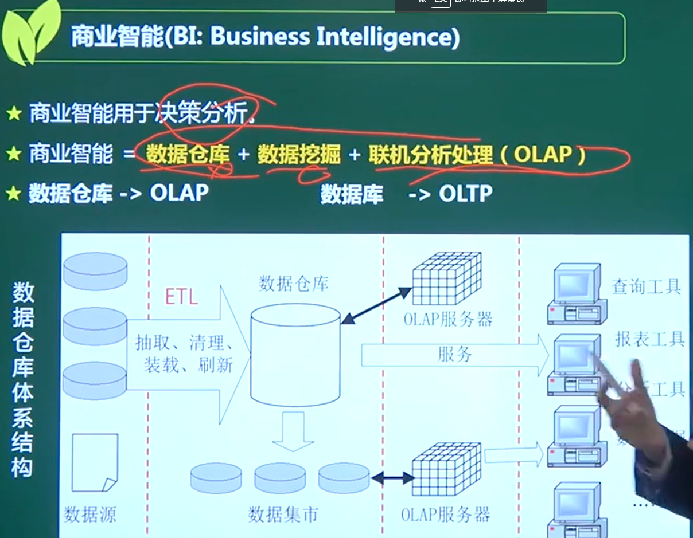

# Business Intelligence

帮助企业用于**决策分析**

**BI = 数据仓库  +  数据挖掘 + 联机分析处理（OLAP）**

## 1、数据仓库与数据库（数据仓库的特点）

### 1、面向主题：数据仓库是面向主题的，数据库是面向系统的。

### 2、集成的：从不同的数据源采集数据，此过程包含ETL操作。

### 3、随时间变化

### 4、信息相对稳定：一般都是做查询操作

*******************************

### ETL（Extract-Transform-Load）

抽取、转换、加载

数据清洗

数据集成

数据归约

## 2、数据挖掘

啤酒和尿布

数据内部间的联系

## 3、联机分析处理（OLAP）

###  OLTP和OLAP的区别

OLTP 银行转账 增删改查 实时处理  ---》数据库

OLAP 主要是查询 ——————》》数据仓库

