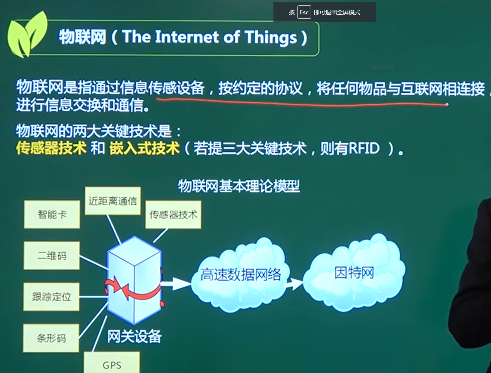
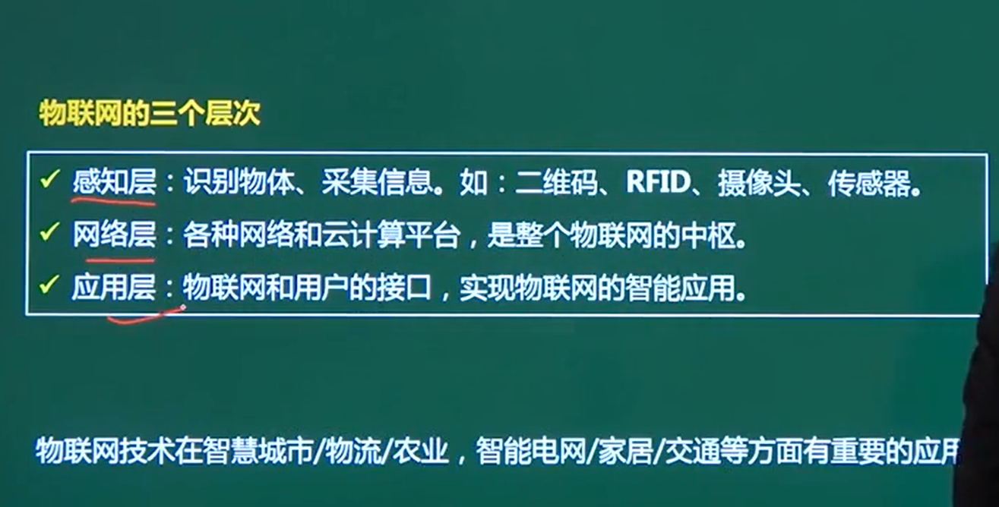
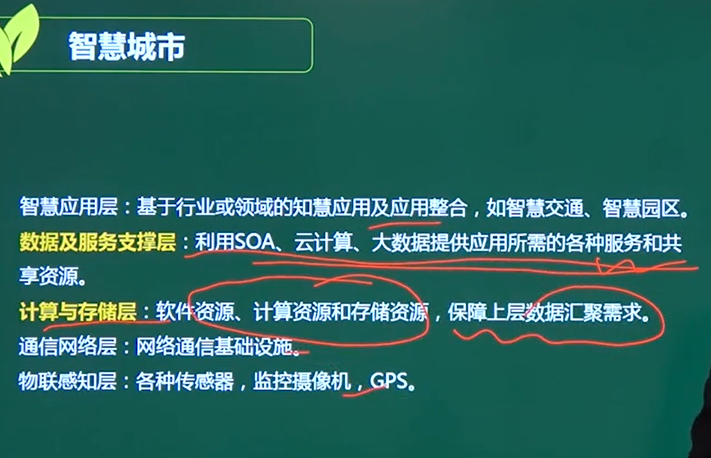

# 物联网

## 1、物联网的两大关键技术

### 传感器技术

### 嵌入式技术

### 第三 RFID

## 2、物联网的三个层次

### 感知层（传感器）

### 网络层（网关）

### 应用层（接口）

## 3、智慧城市

****************************

## 什么是RFID

无线射频识别即射频识别技术（Radio Frequency Identification，RFID），是自动识别技术的一种，通过无线射频方式进行非接触双向数据通信，利用[无线射频](https://baike.baidu.com/item/无线射频/4142085)方式对记录媒体（[电子标签](https://baike.baidu.com/item/电子标签/6976650)或射频卡）进行读写，从而达到识别目标和数据交换的目的，其被认为是21世纪最具发展潜力的信息技术之一。

门禁卡、农场牛标记

