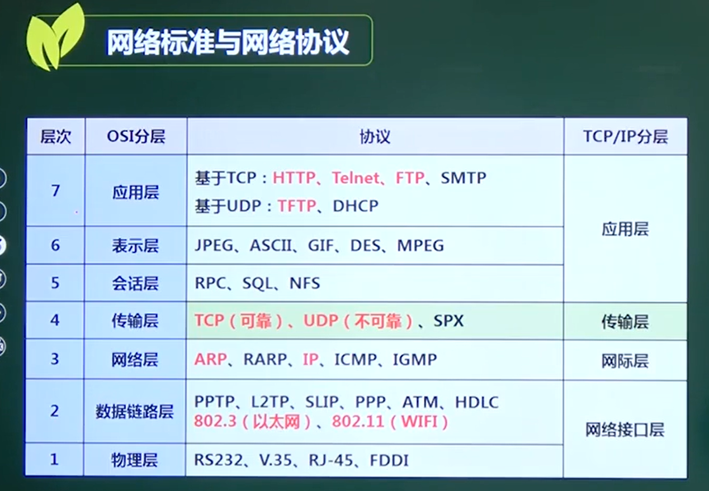
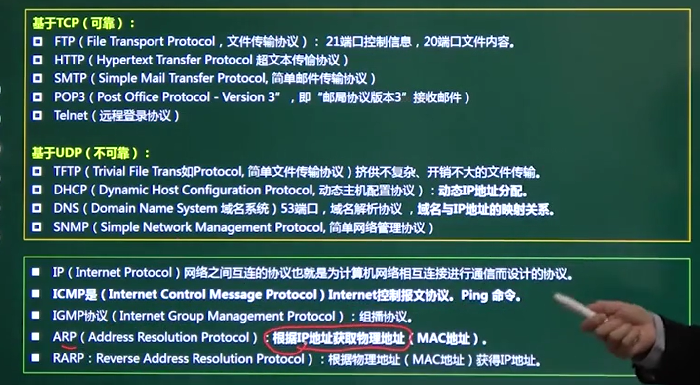

# 网络标准与网络协议

##  一、OSI七层协议 

计算机网络  考3分

网络标准与网络协议 **OSI七层协议** 这部分重点

| 层   | 名称       | 功能                                         | 设备                               |
| ---- | ---------- | -------------------------------------------- | ---------------------------------- |
| 7    | 应用层     | 程序接口                                     |                                    |
| 6    | 表示层     | 应用程序和网络间通信，数据的加密解密         |                                    |
| 5    | 会话层     | 两节点间建立和维持会话                       |                                    |
| 4    | 传输层     | **端到端的连接**、保证数据的可靠、顺序、无错 | TCP\UDP                            |
| 3    | 网络层     | 数据发送方向                                 | 路由器、三层交换机（不同网段通信） |
| 2    | 数据链路层 | 以**帧**为单位                               | 网桥、交换机（多端口网桥）、网卡   |
| 1    | 物理层     | **二进制**传输（高低电平）                   | 集线器、中继器                     |

**注意下三层的硬件设备**

## 二、网络协议 TCP/IP分层

### 1、802.3  以太网

### 2、802.11   WIFI

### 3、ARP地址解析协议  RARP反向地址转换协议

### 4、ICMP   报文控制协议

### 5、IGMP  Group 组播协议

