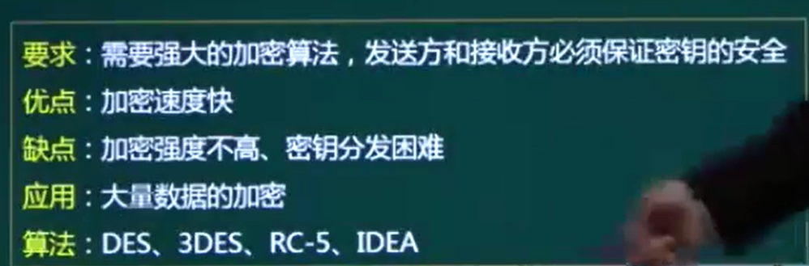

### 安全属性

保密性：信息的保密

完整性：信息的正确性、完整性。

可用性：信息随时可以使用

### 安全技术

加密技术：对称加密、非对称加密

数字签名技术：识别发送者身份

完整性技术：防篡改

认证技术：密码、数字签名

访问控制技术：访问权限控制

### 对称加密

### 非对称加密

### 信息摘要（Hash函数）

1、公钥私钥

2、对称加密和非对称加密

3、RAS

4、数字签名

**私钥加密算法**，又称 **对称加密算法**，因为这种算法解密密钥和加密密钥是相同的。也正因为同一密钥既用于加密又用于解密，所以这个密钥是不能公开的。常见的有《[DES加密算法](https://link.zhihu.com/?target=http%3A//songlee24.github.io/2014/12/06/des-encrypt/)》、《[AES加密算法](https://link.zhihu.com/?target=http%3A//songlee24.github.io/2014/12/13/aes-encrypt/)》。

DES 和 AES

**公钥加密算法**，也就是 **非对称加密算法**，这种算法加密和解密的密码不一样，一个是公钥，另一个是私钥：

- 公钥和私钥成对出现
- 公开的密钥叫公钥，只有自己知道的叫私钥
- 用公钥加密的数据只有对应的私钥可以解密
- 用私钥加密的数据只有对应的公钥可以解密

除了保证数据的安全传输之外，公钥体系的另一个用途就是对数据进行签名。通常**“数字签名”**是用来验证发送方的身份并帮助保护数据的完整性。

### 数字签名的作用是？

一是能确定消息的不可抵赖性，因为他人假冒不了发送方的私钥签名。发送方是用自己的私钥对信息进行加密的，只有使用发送方的公钥才能解密。

二是数字签名能保障消息的完整性。一次数字签名采用一个特定的哈希函数，它对不同文件产生的数字摘要的值也是不相同的。

### 数字签名的原理是？

数字签名技术是将原文通过特定HASH函数得到的摘要信息用发送者的私钥加密，与原文一起传送给接收者。接收者只有用发送者的公钥才能解密被加密的摘要信息，然后用HASH函数对收到的原文提炼出一个摘要信息，与解密得到的摘要进行对比。哪怕只是一个字符不相同，用HASH函数生成的摘要就一定不同。如果比对结果一致，则说明收到的信息是完整的，在传输过程中没有被修改，否则信息一定被修改过，因此数字签名能够验证信息的完整性。

### MAC、DAC、RBAC

## 自主访问控制（DAC: Discretionary Access Control

自主访问控制中，产品中的操作对象被设置了权限等级。

在用户登陆时，系统识别用户，根据被操作对象（Subject）的权限控制列表（ACL: Access Control List）或者权限控制矩阵（ACL: AccessControl Matrix）信息设置用户能对哪些操作对象进行何种操作，例读取操作或能够修改操作对象。

更具特点的是，拥有对象权限的用户，还可以将对象权限分配给其他用户，所以叫“自主（Discretionary）”控制。

Windows中的文档系统的权限设计就是“自主访问控制”模型的典型应用。

## 强制访问控制（MAC: Mandatory Access Control）

MAC设计中所有的访问控制策略都由系统管理员来制定，用户无法改变。每个对象都有权限标识，每个用户也会有权限标识，用户能否操作某个对象判断在于两个权限标识的关系，而关系判断通常由系统做硬性限制。

**（RBAC: Role-Based Access Control)**

在DAC、MAC的基础上， RBAC出现了，RBAC是迄今为止最为普及的权限设计模型。RBAC模型中在用户、权限之间引入“角色（Role）”概念。

RBAC把权限管理过程抽象为“判断逻辑表达式的值是否为True”的求解过程，而逻辑表达式为：

**Who是否可以对What进行How的访问操作（Operator）**

