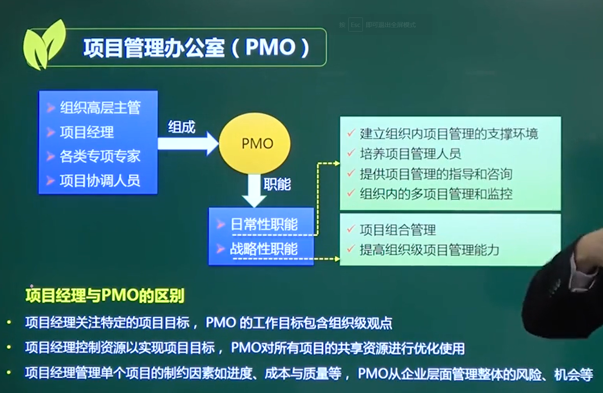

# PMO Project Management Office 项目管理办公室

### 组成：

#### 组织高层、项目经理、各类专项专家、项目协调人员

### 职能：

战略上：

#### 1、项目组合管理

#### 2、提高组织级项目管理能力

### 日常性：

#### 1、组织内项目管理支撑环境

#### 2、培养项目管理人员

#### 3、提供项目管理的指导和咨询

#### 4、多项目管理和监控

