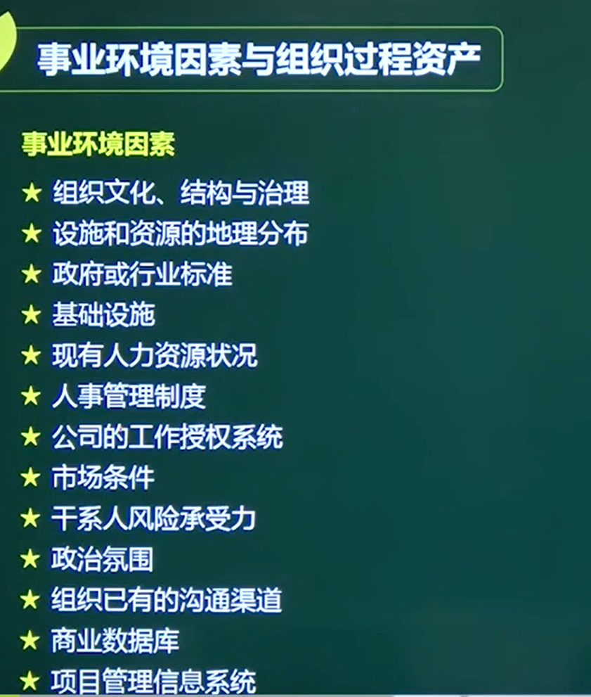
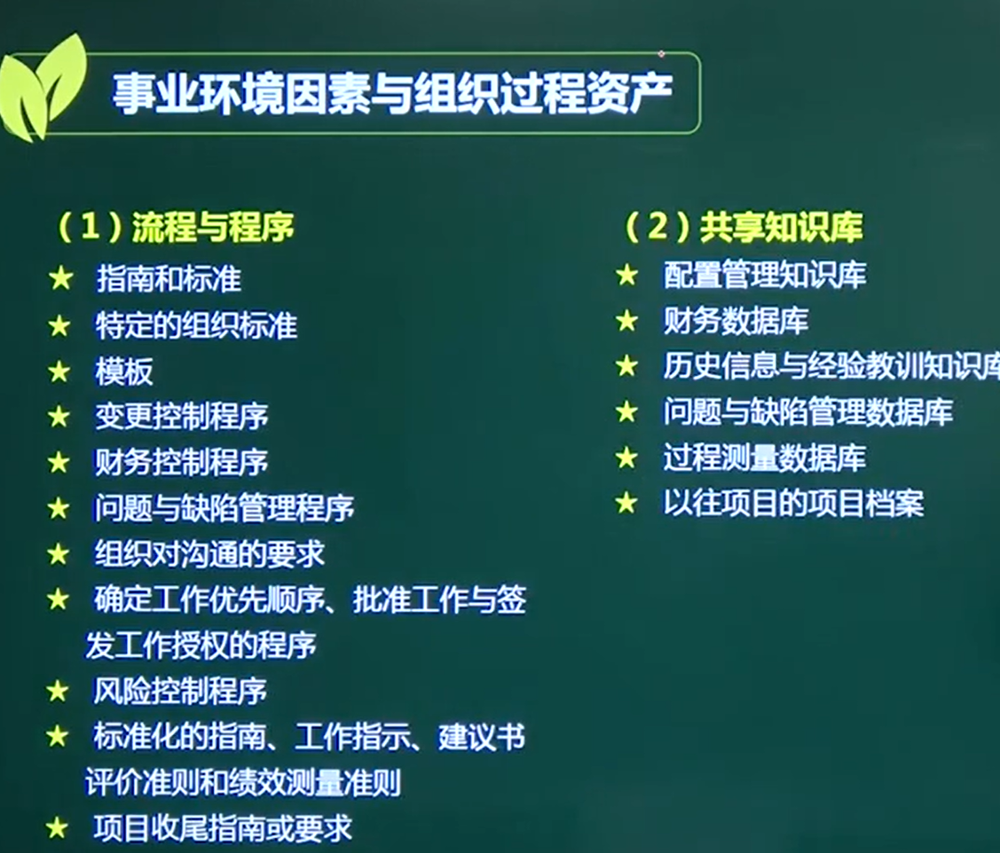

### 绝大部分管理过程的输入

###  根据参考教材，凡是可裁剪的、可选择的均为组织过程资产；凡是不可选择的、只能适应的均为事业环境因素。

## 1、事业环境因素

事业环境因素（EEFs）是指项目团队不能控制的，将对项目产生影响、限制或指令作用的各种条 件。这些条件可能来自于组织的内部和（或）外部。事业环境因素是很多项目管理过程，尤其是大 多数规划过程的输入。这些因素可能会提高或限制项目管理的灵活性，并可能对项目结果产生积极 或消极的影响。

## 2、组织过程资产

[项目组织](https://baike.baidu.com/item/项目组织)在项目管理过程中制定的各种规章制度、指导方针、规范标准、操作程序、[工作流程](https://baike.baidu.com/item/工作流程)、行为准则和工具方法等。 项目组织在项目操作过程中所获得的经验和教训，其中既包括已经形成文字的档案，也包括留在团队成员脑子中没有形成文字的思想。 项目组织在项目管理过程中形成的所有文档，包括知识资料库、文档模板、标准化的表格、风险清单等。 项目组织在以往的项目操作过程中留下的历史信息。

