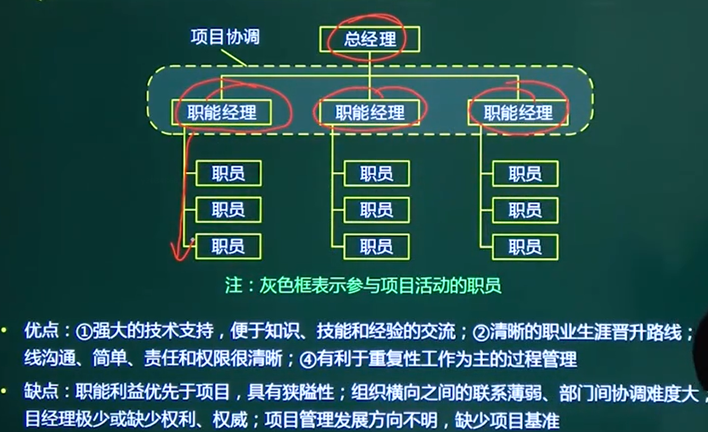
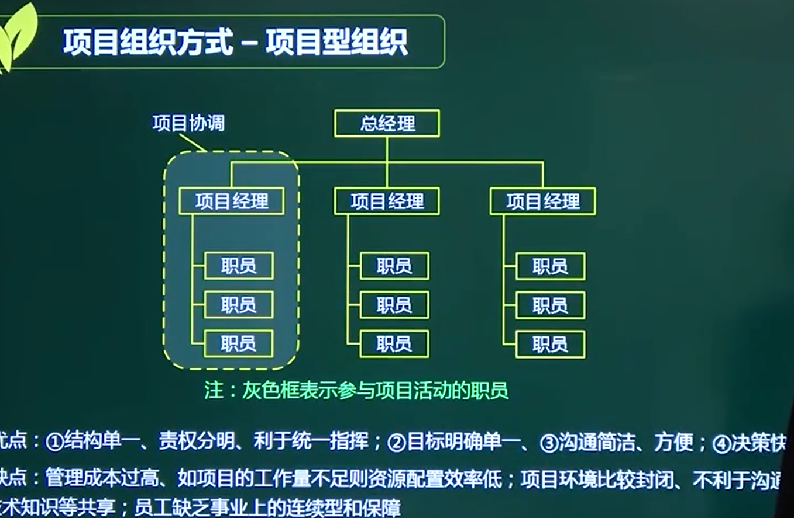
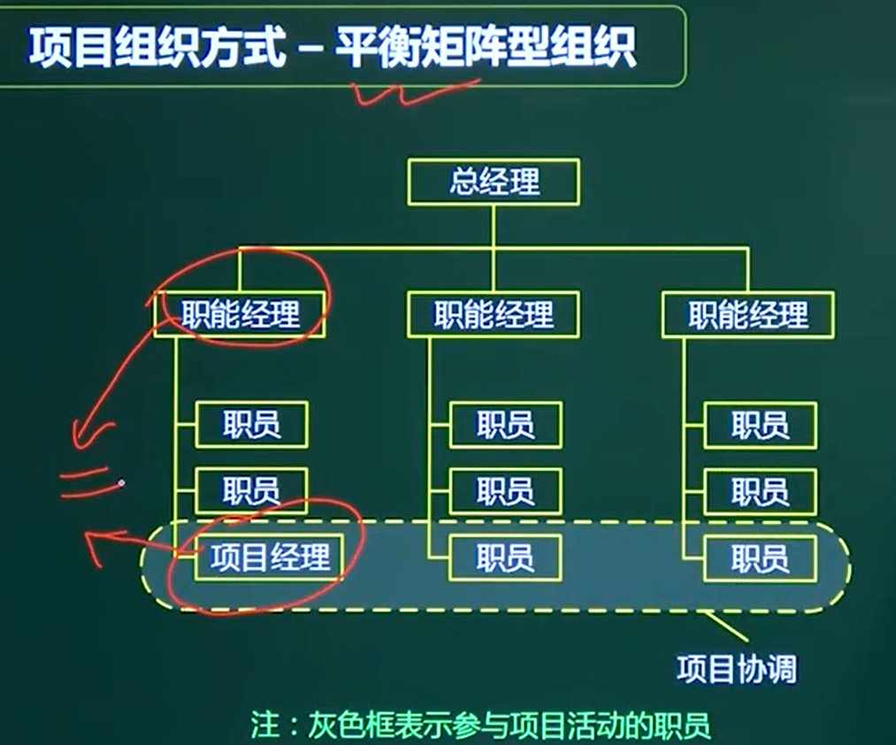
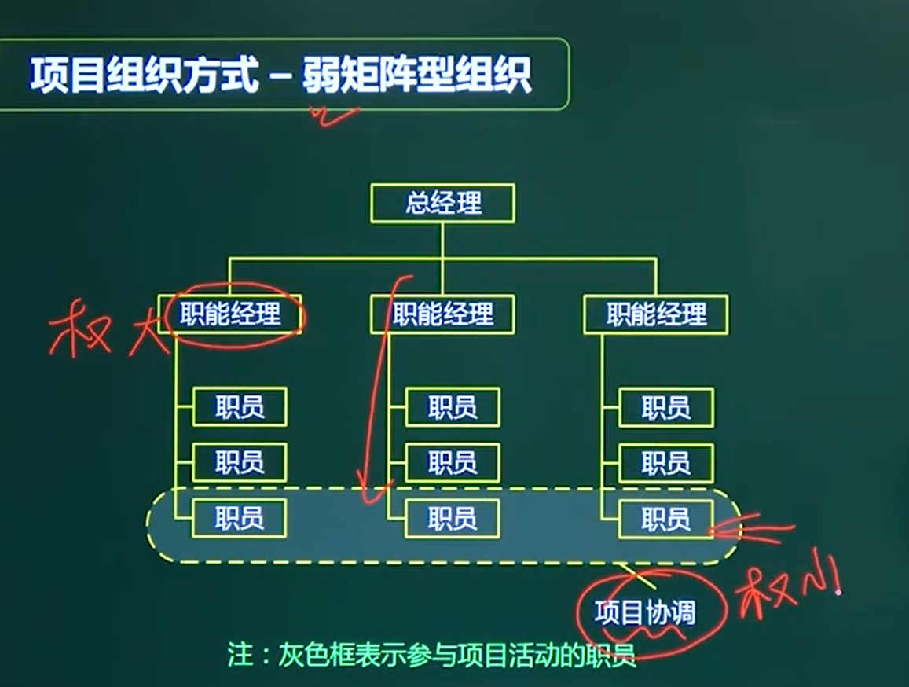
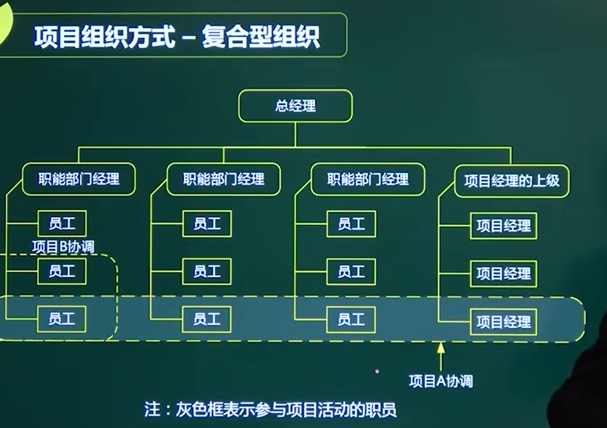
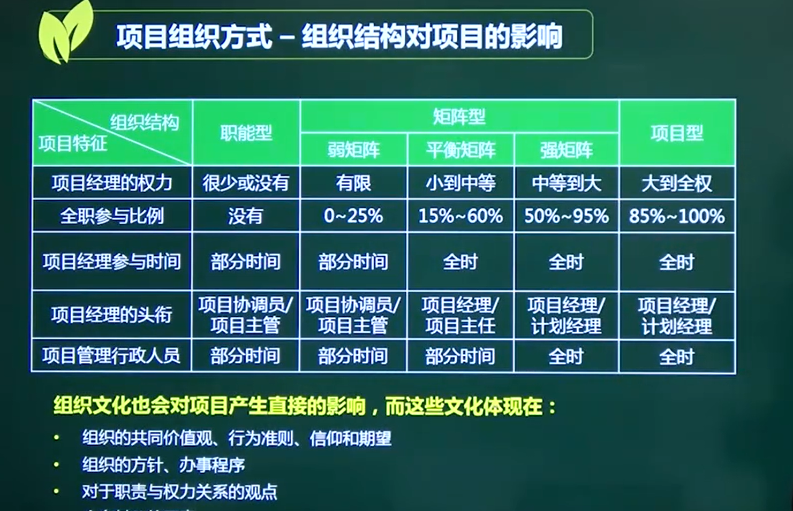

# 项目组织方式

根据图判断 组织方式

根据优缺点判断题

## 一、职能型

**横向联系薄弱、部门协调难度大**

**晋升路线清晰**

重复性工作

## 二、项目型

环境封闭，不利于外部沟通

员工缺乏连续性

## 三、矩阵型

### 3.1平衡矩阵

**======》》 项目经理和职能经理对等**

**多头领导 管理成本高**

**职能型和组织型**的优点

### 3.2、弱矩阵型

增加了项目协调

###  3.3、强矩阵

===》》项目经理权力大

#### 项目经理的经理

## 四、复合型

### 到强矩阵才开始谈项目经理

### 只有强矩阵才会出现全职的项目管理行政人员

