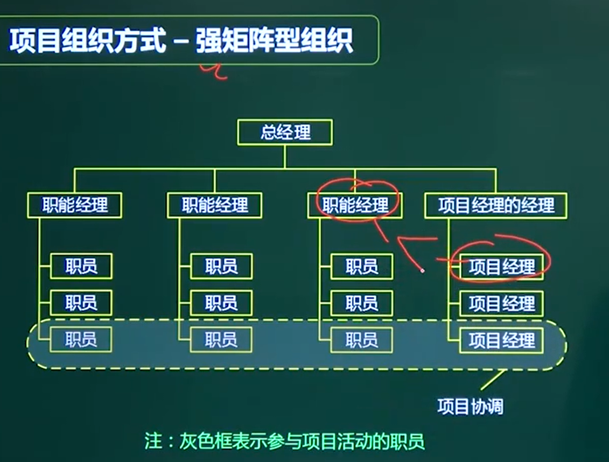

# 项目组织方式

根据图判断 组织方式

根据优缺点判断题

## 一、职能型

## 二、项目型

## 三、矩阵型

### 3.1平衡矩阵

**======》》 项目经理和职能经理对等**

**多头领导 管理成本高**

**职能型和组织型**的优点

### 3.2、弱矩阵型

###  3.3、强矩阵

===》》项目经理权力大

## 四、复合型

### 到强矩阵才开始谈项目经理

