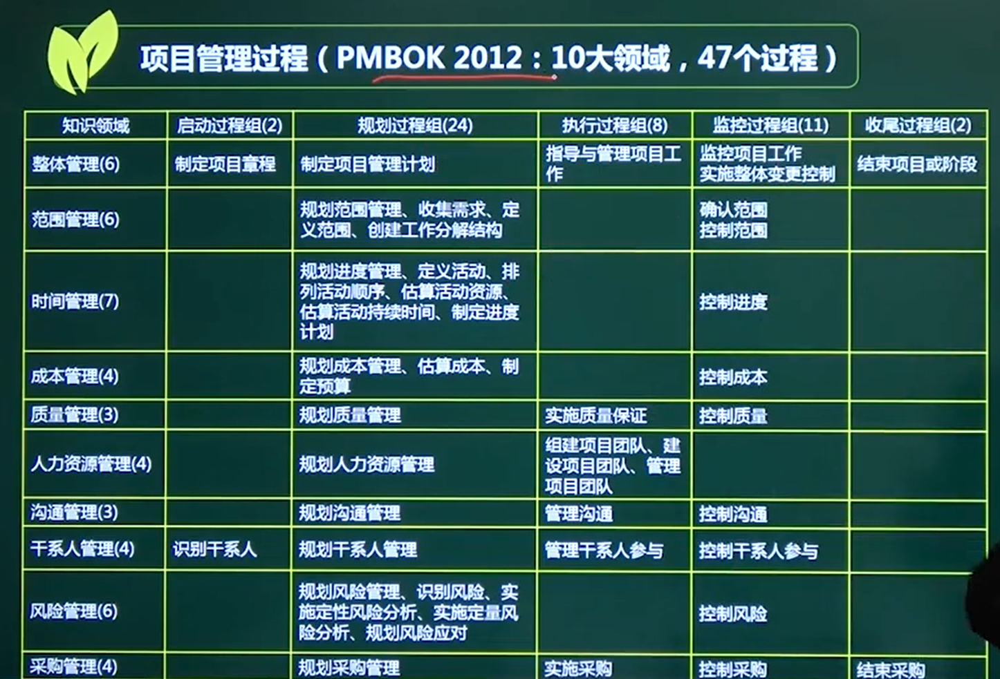

# 项目管理过程与过程组

## 一、过程

过程是一组为了完成产品、服务而执行的相互联系的行动和活动。

## 二、五大过程组

#### 1、启动过程组

#### 2、规划过程组

#### 3、执行过程组

#### 4、监控过程组

#### 5、收尾过程组

#### 戴明环PDCA

plan do check action

## 二、项目管理过程

### 10大领域、47个过程

#### 整体管理具有特殊性

#### 范围、时间、成本、质量为核心

#### 人力、沟通、干系人、风险、采购为辅助

