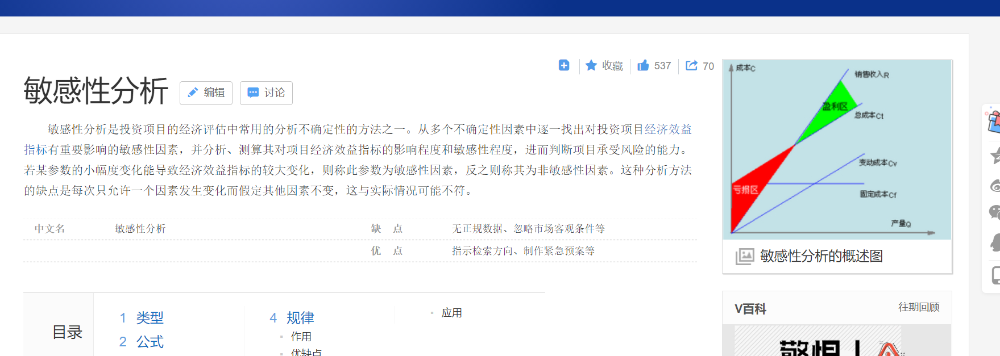

### 考点

综合知识 2 - 4 分

## 项目立项管理内容

项目建议书

项目可行性研究

项目招投标

## 1、项目建议书

项目建议书是项目发展的初始阶段，**是国家或上级主管部门选择项目的依据，也是可行性研究的依据。**涉及利用外资的项目，在项目建议书批准后，方可开展对外工作。有些企业单位根据自身发展需要自行决定建设的项目，也参照这一模式，首先编制项目建议书。

==》 申请资金

### 项目建议书核心内容

项目的必要性

项目的市场预测

产品方案或服务的市场预测

项目建设必须条件

## 2、可行性研究

### 2.1、可行性研究的内容

技术、组织、经济、财务、运行环境、法律、社会

#### 技术可行性分析

技术能力、产品功能、**人力资源**（人员技能）

你的技术团队能不能做。

#### 经济可行性分析

支出、收益分析

收益投资比

投资回收期

**敏感性分析**

#### 运行环境可行性分析

软件交付后，能否顺利运行。

用户单位的硬件平台、管理体制、人员素质、工作习惯。

#### 组织可行性

#### 财务可行性

财务可行性偏微观，经济为宏观

#### 风险因素及对策

### 2.2、初步可行性研究

===》初步可行性研究报告 （能作为决策依据）

在对市场或客户情况进行调查后，对项目进行初步评估

### 2.3、详细可行性研究

在技术、经济、社会、运行环境、法律等方面进行深入调查

**小的项目可以直接详细可行性研究**

### 2.4、可行性研究报告

**（1）、项目概述（项目背景、可行性研究的结论）**

（2）、项目的技术背景与发展情况

**（3）、现系统业务、资源、实施情况分析**

**（4）、项目技术方案**

**（5）、实施进度计划**

**（6）、投资估算与资金筹措计划**

（7）、人员及培训计划

（8）、不确定性（风险）分析

（9）、经济和社会效益的预测瓶据

（10）、可行性研究结论与建议

### 2.5、项目财务绩效评估方法xxxxxx

