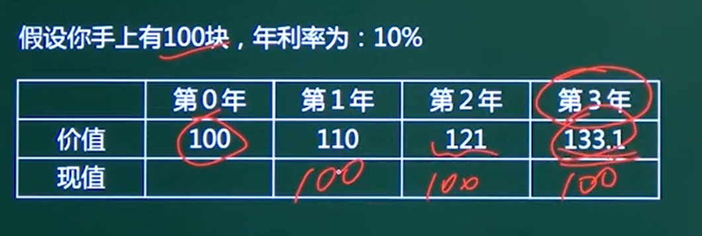

## 项目财务绩效评估方法

## 1、净现值计算

### 1、现值与净现值分析

#### 动态成本和静态成本的区别

#### 价格和现值

#### 净现值 NPV

**全周期净收益转成现值**

## 2、投资回收期

### 1、投资回收期

收回全部投资的年限、一般**从建设期开始计算**

判别基准为**基准投资回收期**（参考系，一般是X年收回成本）

分为 **静态投资回收期和动态投资回收期**

年末没收回的钱/下一年净盈利

## 3、投资收益率 ROI  静态

投资收益率 ROI = （总折现收益 - 总折现成本）/折现成本

## 4、成本效益分析xxxxxxxxx

### 成本：

一次性成本：开发费、培训费、差旅费、设备购置费

非一次性成本：租金、员工工资福利、耗材、设施使用费

### 开发总成本：

经营成本（**研发成本、行政管理费、销售分销费用**）

财务费用和折旧（贷款）

----------------------------------------------------------------------------------------

直接成本：项目经理可控 项目资金

间接成本：房租等分摊性成本

## 收益

直接收益：产品销售

间接受益：成本降低

