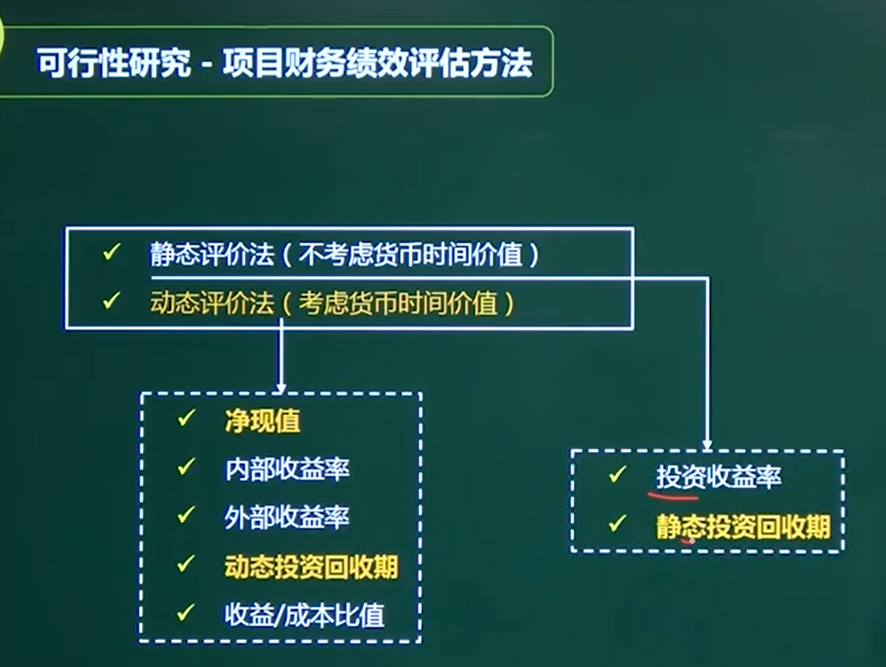

# 项目立项管理

### 考点

综合知识 2 - 4 分

## 一、项目立项管理内容

项目建议书

项目可行性研究

项目招投标

## 二、项目建议书（立项申请书）

### 2.1、概念

项目建议书是项目发展的初始阶段，**是国家或上级主管部门选择项目的依据，也是可行性研究的依据。**涉及利用外资的项目，在项目建议书批准后，方可开展对外工作。有些企业单位根据自身发展需要自行决定建设的项目，也参照这一模式，首先编制项目建议书。

### 2.2、核心内容

1、项目的必要性

2、项目的市场预测

3、产品方案或服务的市场预测

4、项目建设必须条件

## 三、可行性研究

### 2.1、可行性研究的内容

技术、组织、经济、财务、运行环境、法律、社会

#### 技术可行性分析

技术能力、产品功能、**人力资源**（人员技能）

你的技术团队能不能做。

#### 经济可行性分析

1、支出、收益分析

2、收益投资比

3、投资回收期

4、**敏感性分析**（经济）

#### 财务可行性

财务可行性偏微观，经济为宏观

#### 运行环境可行性分析

软件交付后，能否顺利运行。

用户单位的硬件平台、管理体制、人员素质、工作习惯。

#### 组织可行性

#### 风险因素及对策

*********************************************************

### 区别

####  初步可行性研究和详细可行性研究从内容上是基本一致的

初步可行性研究是在机会研究的基础上，对项目方案的**技术、经济**条件进一步论证，对项目是否可行进行初步判断。研究的目的是判断项目的构想是否有生命力，评价是否应当开始进行详细的可行性研究和辅助研究。

详细可行性研究是在项目决策前对项目有关的**技术、经济、法律、社会环境等方面的条件和情况进行详尽的、系统的、全面的调查**、研究、分析，对各种可能的技术方案进行详细的论证、比较，并对项目建设完成后所可能产生的经济、社会效益进行预测和评价，最终提交的可行性研究报告将成为项目评估和决策的依据。

**************************************************

### 辅助性研究

辅助性研究是可行性研究中就某个专门性问题提出的研究。一般只能作为初步可厅性研究、可行性研究和大规模投资建议的前提或辅助。

### 2.2、初步可行性研

在对市场或客户情况进行调查后，对项目进行初步评估

1、是不是继续做这个项目

2、初步可行性研究报告 （**能作为决策依据**）

3、初步估计必须进行的**辅助研究**，以及解决项目的核心问题

### 2.3、详细可行性研究

在技术、经济、社会、运行环境、法律等方面进行深入调查

**小的项目可以直接详细可行性研究**

### 2.4、可行性研究报告

技术、实施计划、风险、经济

**（1）、项目概述（项目背景、可行性研究的结论）**

（2）、项目的技术背景与发展情况

**（3）、现系统业务、资源、实施情况分析**

**（4）、项目技术方案**

**（5）、实施进度计划**

**（6）、投资估算与资金筹措计划**

（7）、人员及培训计划

**（8）、不确定性（风险）分析**

（9）、经济和社会效益的预测瓶据

（10）、可行性研究结论与建议

### 2.5、项目财务绩效评估方法的分类

