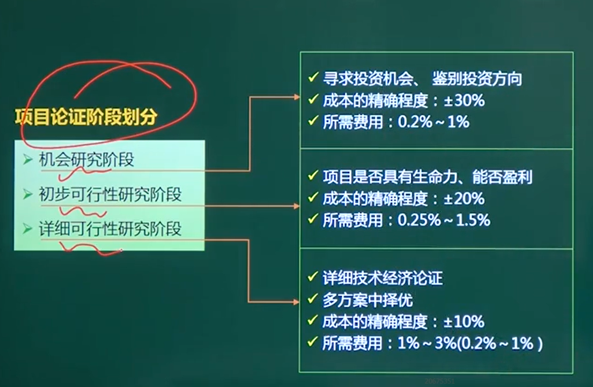
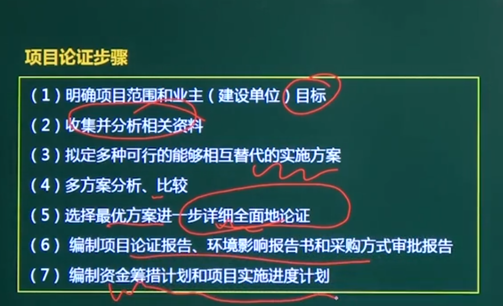

## 项目论证

#### **先论证，后决策**是现代项目管理的原则

项目论证围绕**市场需求、开发技术、财务经济**三个方面分析

## 一、作用

1、项目论证是项目是否能够实施的依据

2、筹措资金、银行贷款的依据。

3、设计、采购的条件

4、规避风险

## 二、阶段

**1、机会研究阶段**

**2、初步可行性研究阶段**

**3、详细可行性研究阶段**

## 三、项目论证的步骤

