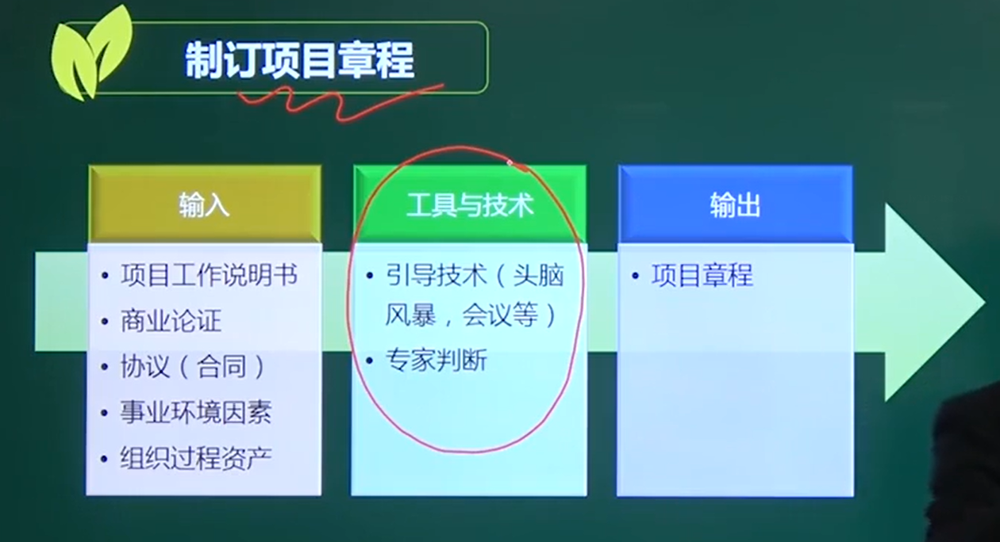
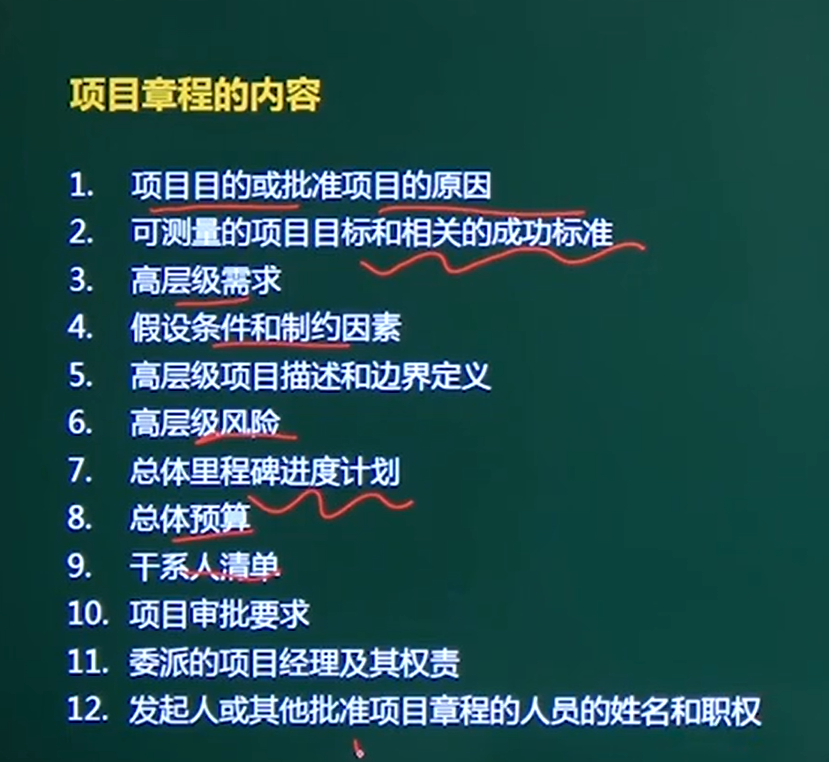

# 项目章程

## 一、项目章程的作用------授权

编写一份正式批准项目并授权项目经理在项目活动中使用组织资源的文件的过程。

1、确定项目经理，规定项目经理的权利。

2、确认项目

3、项目的总体目标，包括  **范围、时间、成本、质量**。

4、执行组织、运营组织的战略计划管理起来。

####  由项目发起人（高管，不能是项目经理）发布

## 二、制定项目章程

### 1、头脑风暴（引导技术）

创意性、畅所欲言、开放性的。

### 2、事业环境因素、组织过程资产

为大部分管理过程的输入

### 3、项目工作说明书SOW

项目工作说明书是甲方提供给乙方

我们要一个什么样的东西（最为初步的需求）

项目工作说明书(statement of work，SOW)是对项目产出物和项目工作的说明，这是项目业主或用户给出的项目具体要求说明书，其主要内容有项目要求、项目产出物和工作的说明以及组织[战略规划](https://baike.baidu.com/item/战略规划)目标等。

### 4、商业论证

从商业角度，这个项目是否值得投资。做这个项目的必要性

### 5、合同

合同、谅解备忘录、意向书、口头协议

当项目是由承包商或[供应商](https://baike.baidu.com/item/供应商)为项目业主或用户而实施的业务项目，此时[项目合同](https://baike.baidu.com/item/项目合同)是制定项目章程的根本依据。人们要根据项目合同去制定项目章程，项目章程中的规定都不能违背项目合同中有关双方责任和义务的约定。

## 三、项目章程内容

