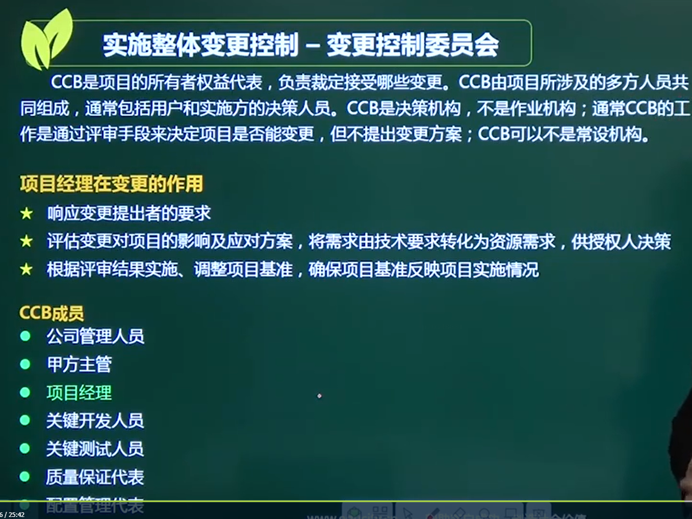

# 实施整体变更控制(重要)

### 什么情况变更、为什么变更

## 一、整体变更控制流程

### 变更申请为书面形式

（需求变化的会议纪要签字）

### 项目变更控制委员会CCB Change Control Board

CCB是系统集成项目的所有者权益代表，负载裁定接受哪些变更。CCB由项目所涉及的多方成员共同组成，通常包括用户和实施方的决策人员。CCB是决策机构，不是作业机构，通常CCB的工作是通过评审手段来决定项目是否能变更，但不提出变更方案。

## 二、实施整体变更控制

## 三、变更的原因

### 增值变更

对项目有好处的变更

## 四、整体变更的原则

